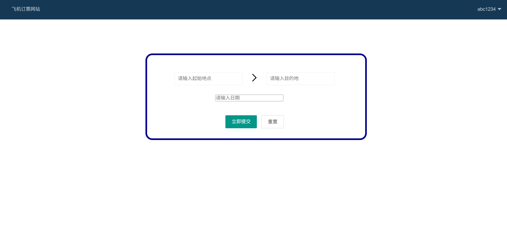
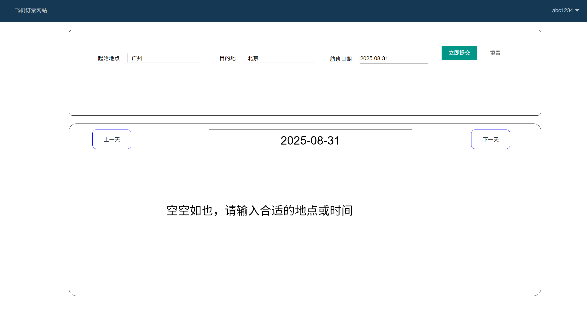
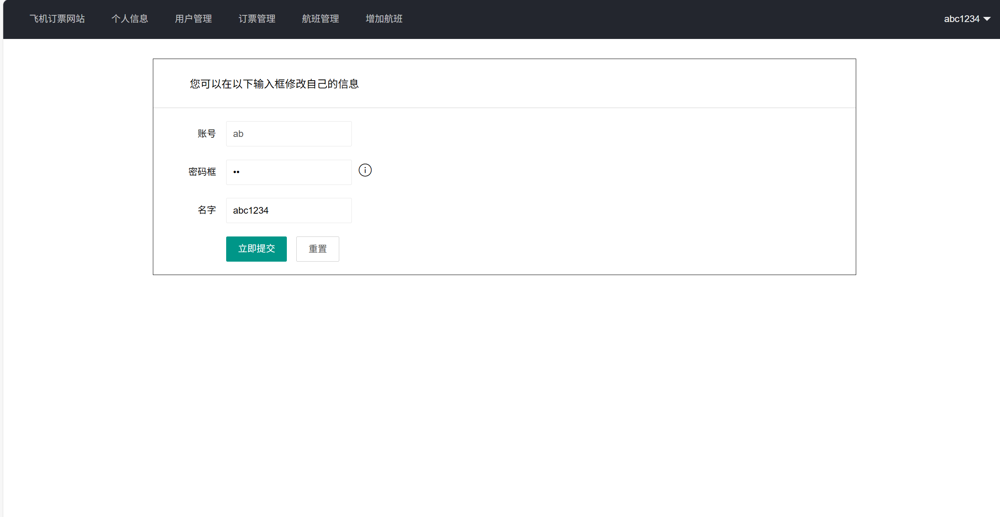
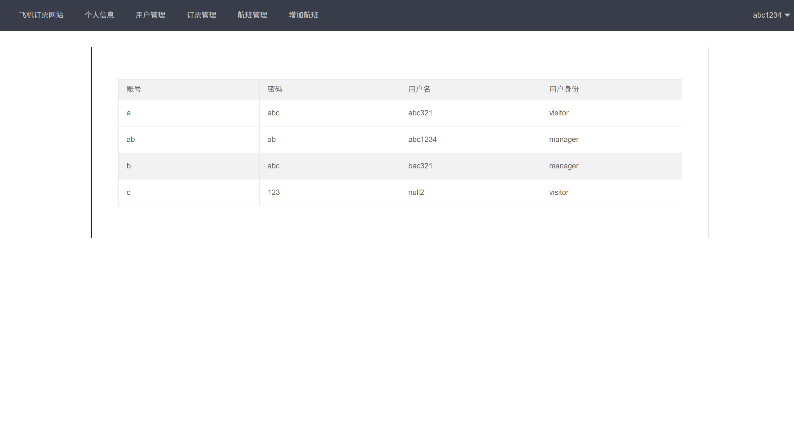
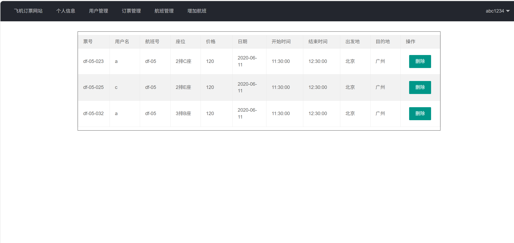
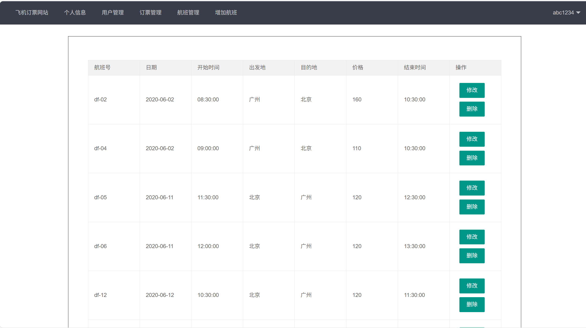
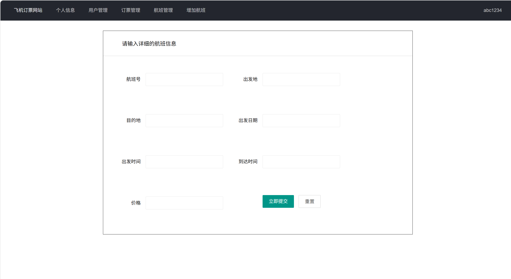
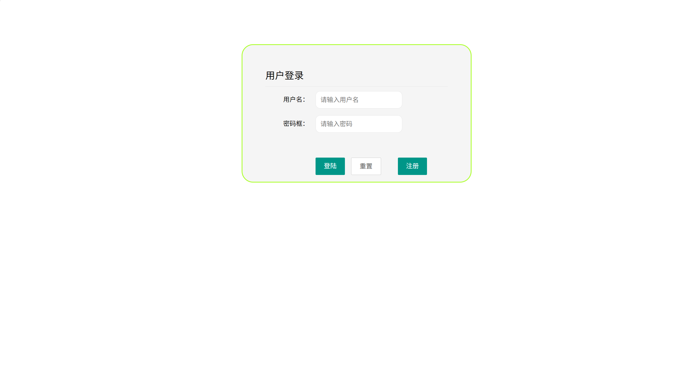

# jspServlet019
jspServlet019航空飞机订票系统
 
## 源码问题查看主页咨询

### 一、关键词

航空飞机订票系统，机票系统

### 二、作品包含
源码+数据库+全套环境和工具资源+本地部署教程

### 三、项目技术
前端技术：Html、Css、Js、Jquery
后端技术：Java、JSP、Servlet、JDBC

### 四、运行环境（以下版本亲测，其他版本兼容性请自行测试）
开发工具：IDEA/eclipse

数据库：MySQL5.7或8.0

服务器：Tomcat8.5或Tomcat9.0

数据库管理工具：Navicat10以上版本

环境配置软件： JDK1.8

浏览器：谷歌浏览器

### 五、项目介绍

项目编号：jspServlet019

飞机订票网站是为旅客提供便捷航空票务服务，以及为航空公司等运营方提供管理渠道的综合性网络平台。以下从用户端和管理端两方面介绍其功能与特性：

该飞机订票网站具备个人信息管理、用户管理、订票管理、航班管理以及增加航班等功能，同时可对机票信息（票号、用户名、航班号、座位、价格、日期、起止时间、出发地、目的地等）进行展示与删除操作。

### 六、运行截图

